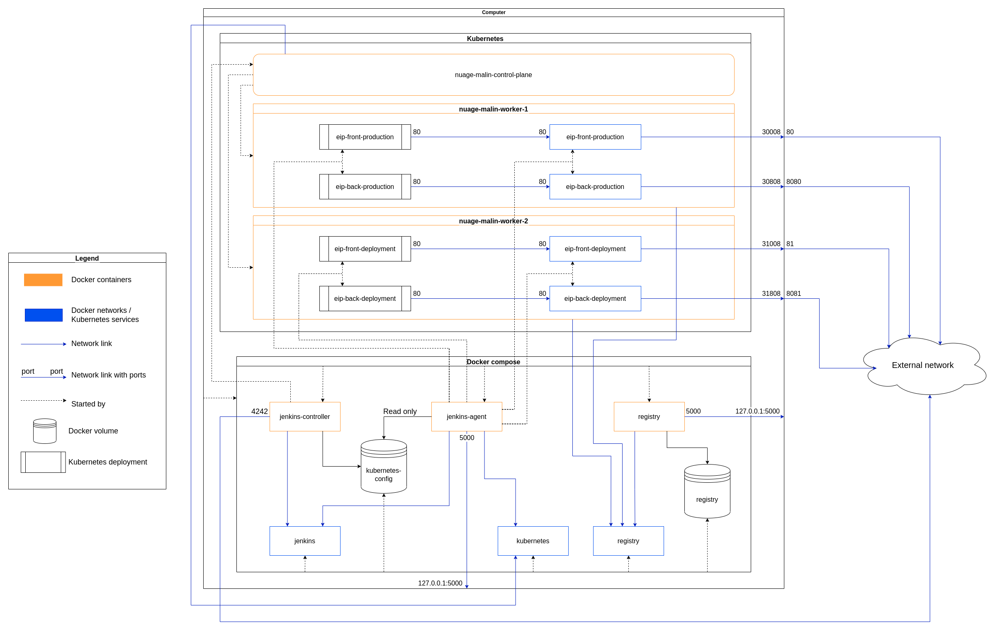

# Requirements

## Softwares
- **Docker :** 20.10.18
- **Docker Compose :** v2.10.2

## Files
### Environment variables
- **File :** *./.env*
- Add **GIT_REPOSITORY_URL_FRONT** and **GIT_REPOSITORY_URL_FRONT** variables that are the full repositories names templated as `user-or-organisation-name/repository-name`.

### Jenkins users
- **File :** *./jenkins/users.yml*
- This is a YAML file with a ***users*** parent with an array of users as value.  
A user contains a ***name***, a ***password*** and an array of ***roles***.  
The available roles are :
    - Admin (full access)
    - Manager (Read, Build, Cancel jobs)
    - Developer (Read, Cancel jobs)
    - Visitor (Read jobs)

    <u>Exemple :</u>
    ```yaml
    users:
    - name: John Doe
        password: password_1
        roles:
        - Visitor
    - name: Jane Doe
        password: password_2
        roles:
        - Developer
    ```

### Secrets
- **File :** *./secrets/*
    - *nm_eip_back_ssh*
    - *nm_eip_front_ssh*
- *nm_eip_back_ssh* and *nm_eip_front_ssh* files are private SSH keys linked to public keys added to GitHub [frontend](https://github.com/Nuage-Malin/eip-frontend/settings/keys) and [backend](https://github.com/Nuage-Malin/eip-backend/settings/keys) repositories as **Deploy keys**.  
This keys are used by Jenkins to pull there repositories.

# Startup

1. Start the docker compose
```shell
docker compose up --build
```
This will build and start the **Jenkins controller**, the **Jenkins Agent** and the **Docker registry**.  
Before starting Jenkins, the controller will [start](/jenkins/kubernetes/setup.sh#L12) the **Kubernetes cluster** that can take few minutes, then it will [connect](/jenkins/kubernetes/setup.sh#L16) it to Docker networks and [configurate](/jenkins/kubernetes/setup.sh#L24) it.  
The Jenkins Agent is the only one to run jobs. Jobs on the master node has been disabled.


# Diagram

